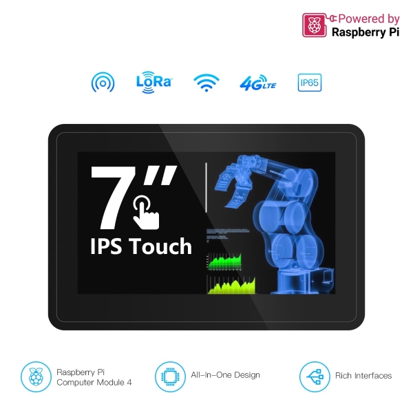

#### 1, Product picture

#### 2, Product version number

|      | Hardware | Software | Remark |
| ---- | -------- | -------- | ------ |
| 1    | V2.1     | V1.0     | latest |

#### 3, product information

| **Processor (CM4)**               |                                                              |
| --------------------------------- | ------------------------------------------------------------ |
| CPU/SoC                           | Broadcom BCM2711 Quad-core Cortex-A72 (ARM v8) 64-bit SoC @ 1.5GHz |
| System Memory                     | 4GB（LPDDR4-3200 SDRAM）                                     |
| Storage                           | Operating system 64G SD memory card((lmage File Loaded)), compatible with SSD slot expansion (customers can purchase it by themselves)(No eMMC) |
| Operating System                  | Raspbian (compatible with Node-RED), compatible with all software running on Raspberry Pi (pre-installed system) |
| **Compatibility**                 |                                                              |
| Operating system                  | Raspbian Ubuntu Mate Ubuntu Core                   |
| Software                          | a. Integrated Node-RED software, supports OpenGL ES 3.0, pre-installed with the latest 64-bit Raspberry Pi OS, ready to use out of the box; b. Compatible with all software running on Raspberry Pi. |
| **Display**                       |                                                              |
| Size                              | 7 inch                                                       |
| Panel Type                        | IPS Panel                                                    |
| Resolution                        | 1024(RGB)×600                                                |
| Aspect Ratio                      | 4：3                                                         |
| Brightness                        | 400 cd/m²                                                    |
| Touch Type                        | 5-point Capacitive Touch                                     |
| **Wireless Communication**        |                                                              |
| Wi-Fi                             | 2.4GHz and 5.0GHz (CM4 onboard)                              |
| Bluetooth-compatible              | Bluetooth-compatible 5.0(CM4 onboard)                        |
| LoRa                              | Mini PCIE-52P interface; interface power supply voltage: 3.3V Support LR1302 LoRaWAN SPI/USB interface gateway module; Support M.2 NVME SSD (requires M.2 to Mini PCIE interface adapter board); see WIKI for specific pin definitions |
| 4G LTE                            | Mini PCIE-52PInterface; Interface power supply voltage: 3.8V Supports ELE7670 4G series modules, see WIKI for specific pin definitions |
| Reserved Interface (external)     | 1x RS232 (DB9 Female); 1x UART(Type-C, USB2.0 to TTL); 2x USB-A 2.0 Host port (USB-5V); 1x Headphone&Microphone(3.5mm audio line-out and audio mic); 1x HD (Standard HD,5V); 1x Ethernet Interface (RJ45,10/100/1000 Mbps); 1x DC Socket;1x Micro SD Slot; 1x Nano SIM Slot; 1x RS485/CAN/ADC Interface(12-Pin Phoenix Type Connector, lead out from the same terminal, capacitor isolation); 2x DI/IO Interface (8-Pin Phoenix Type Connector, Lead out from the same terminal, photoelectric isolation); 1x Relay Interface (6-Pin Phoenix Type Connector); 1x Programming button interface(4-Pin Connector);1x CR1220 Battery Holder |
| **Reserved Interface (internal)** | 2x20P for GPIO;2x2P for POE; 2x4P for USB 2.0; 1x Mini-PCIe socket for LoRa; 1x Mini-PCIe socket for 4G; 1x M.2 SSD Socket (Compatible with SSD2230/2242/2280); 1x Fan connector (4-Pin connector); 1x Speaker Interface(6-Pin connector); 2x Camera Sockets (FPC/FFC, CSI0&CSI1,3.3V); |
| **Button/Indicator/Other**        | Power Button                                                 |
|                                   | Sleep/Wake button                                            |
|                                   | POWER Indicator                                              |
|                                   | USER Indicator                                               |
|                                   | Status Indicator                                             |
|                                   | Built-in buzzer                                              |
|                                   | RTC clock                                                    |
| **Other**                         |                                                              |
| Dimension Size(With Shell)        | 192\*125\*46mm                                               |
| Dimension Size(Without Shell)     | 182\*115*29mm                                                |
| Shell                             | Acrylic Shell                                                |
| Net Weight                        | 1Kg（Include Shell）                                         |
| Antenna interface                 | 4 removable antenna holes are reserved for SMA external antennas |
| Cooling method                    | Exposed/Fan cooling on the shell                             |
| **Working Environment**           |                                                              |
| Protection level                  | Front panel is dust and water resistant, IP65                |
| Operating Temperature             | -10~60 °C                                                    |
| Storage Temperature               | -20~70 °C                                                    |
| Relative humidity                 | 10%-90%,@ 40°C (non-condensing)                              |
| **Power Supply**                  |                                                              |
| Input                             | 12V~36V DC (3A)                                              |
| Power                             | About 9W (load)                                              |

#### 4,Folder structure.

|--3D file： Contains 3D model files (.stp) for the hardware. These files can be used for visualization, enclosure design, or integration into CAD software.

|--Datasheet: Includes datasheets for components used in the project, providing detailed specifications, electrical characteristics, and pin configurations.

|--Pi Terminal Node Red Tutorial: Provides example code and projects to demonstrate how to use the hardware and libraries. These examples help users get started quickly.